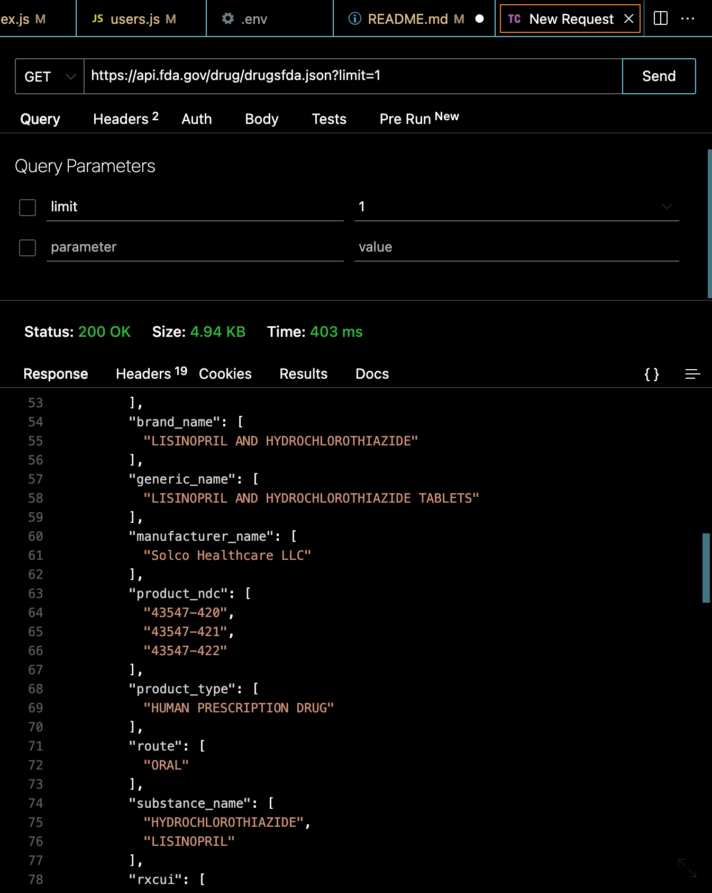
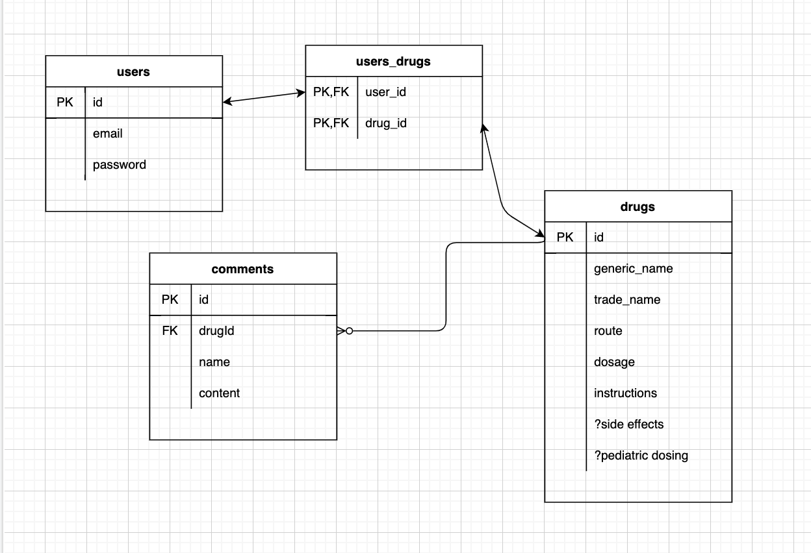
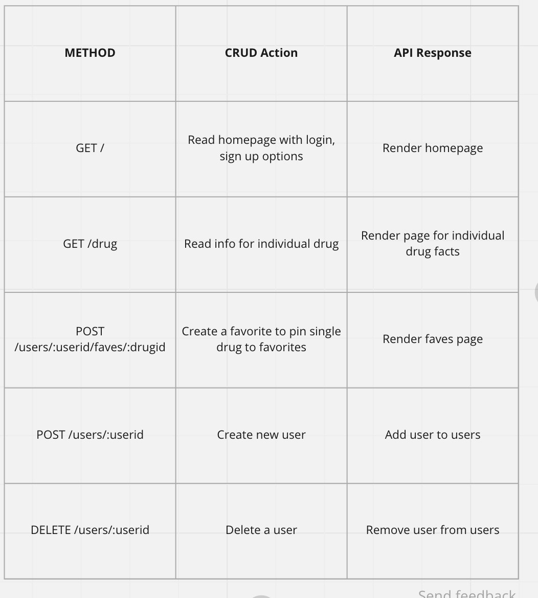
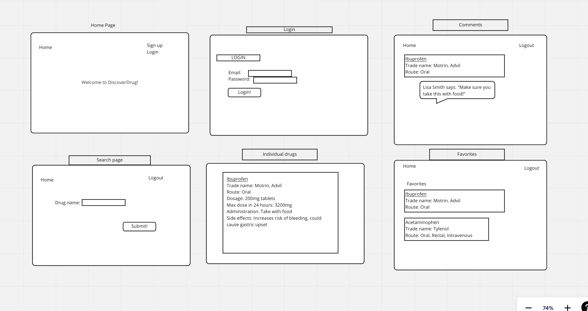

# DiscoverDrug

### Project Idea
An app that will allow users to look up details of any medication they search for and save their favorites to see again in the future. The app will also include the ability to leave comments based on side effects experienced.

### Project Description
I want to create an app that will allow users to look up specific drugs to get their generic and brand names as well as route and administration instructions. Users will be able to make a profile with an email and password and then they can save different drugs that they may want to return to in the future. I also want users to have the ability to comment on the drugs database with side effects they've experienced so other users can be aware.

### Choice of API:
1. base endpoint: https://api.fda.gov/drug/drugsfda.json
    - 120,000 requests per day

### ERDs:

### RESTful Routing Chart:

### Wireframes

### User Stories
* As a user, I want to look up a drug I'm curious about and get information on it.
* As a user, I want to save different drugs I've searched in a favorites list for easy reference.
* As a user, I want to create an account with email and password.
* As a user, I want to be able to read and create my own comments on individual drugs.
* As a user, I want to be able to update or change my email or password.

## GOALS

### MVP Goals:
- User can sign up for account using email and password
- User can change password or update email address
- User can search drug by name (generic or trade) and have requested information returned
- User can save their searches in "favorites" for future use
- User can comment on a given drug regarding side effects (or other comments about the drug)

### Stretch Goals:
- Incorporate ability for drug dosage to be returned in weight-based dosing format for pediatric dosing
- Add ability to search symptoms and be given potential diagnosis (possibly including another API)

