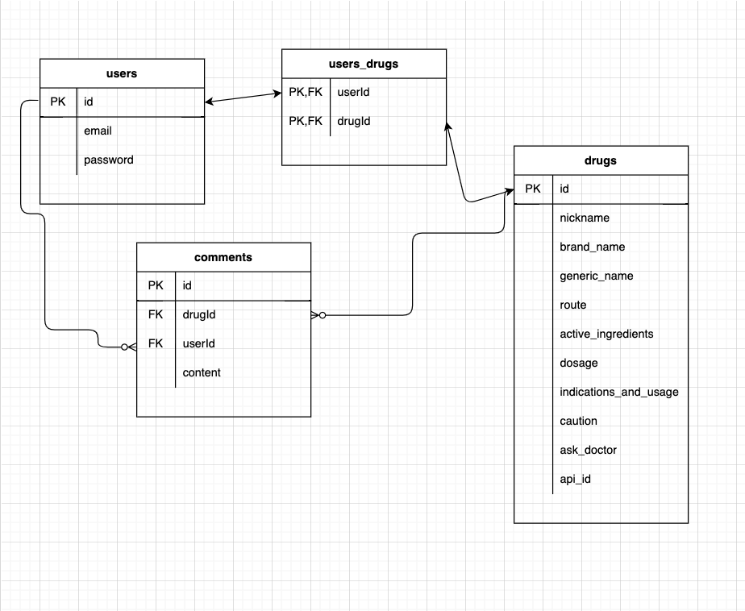
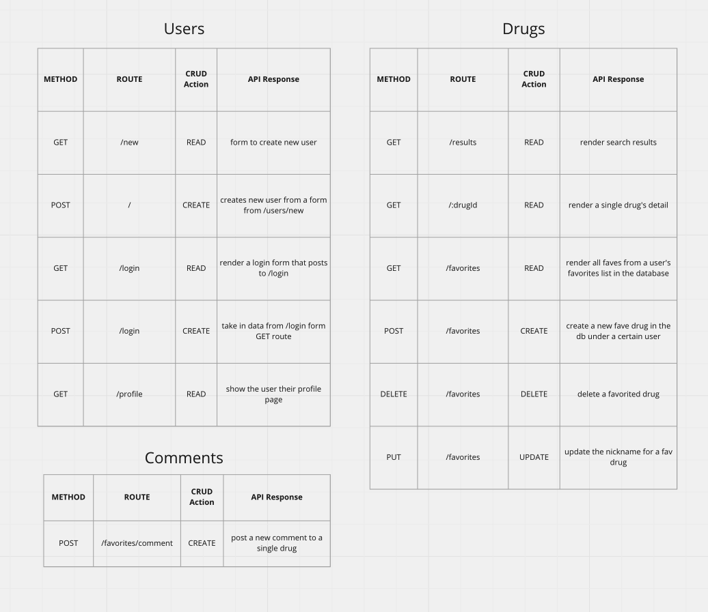

# DiscoverDrug

### App Description
DiscoverDrug is an app that allows users to look up specific drugs to get their generic and brand names as well as route and administration instructions. Users can create a profile with an email and password, and then they can search the FDA's vast API to see details about any drug. They can also save different drugs that they may want to return to in the future. Additionally, users can add a comment on specific drugs, noting any side effects or tips and tricks they may want to share with the rest of the users.

### Instructions to Install:

* Fork and clone this repository
* Run `npm init -y`
* Within the newly cloned repo, open `package.json` file for a list of required `dependencies`
* In your terminal, run `npm install` for each of the required npm packages. Check to make sure `node_modules` and `.env` are both present and noted in the `.gitignore` file
* Create your local database using `sequelize db:create`, then migrate the models specifics using `sequelize db:migrate`.
* You're ready to go!

### LINK:

Link to app: https://discover-drug-app-deploy.herokuapp.com

### Approach Taken:
I started this project by making sure the API I chose (FDA) was going to be easy to use and give me the data I wanted. The FDA API ended up working perfectly and had more than enough data for my project. I then thought through my route structure and constructed my models to be added to the database. Once I had the backend set up, I moved to work on the basic rendering of a single drug. Once I was able to do that, I worked to add a 'favorite' button and then eventually added the comments option. Originally I had it set up so users could only comment on drugs they had already favorited, but then I decided to broaden that so that users could comment on any drug, whether or not it was a favorite. That pivot took much more time and thought process than I originally alloted so I wasn't able to refine my routing semantics or styling to the point I wanted. But I prioritized a working app over style.

### Choice of API:
1. base endpoint: https://api.fda.gov/drug/drugsfda.json
    - API: '##################' (in .env file)
    - 120,000 requests per day

### ERDs:

### RESTful Routing Chart:

### Wireframes

### User Stories
* As a user, I want to look up a drug I'm curious about and get information on it.
* As a user, I want to save different drugs I've searched in a favorites list for easy reference.
* As a user, I want to create an account with email and password.
* As a user, I want to be able to read and create my own comments on individual drugs.
* As a user, I want to be able to update or change my email or password.

### GOALS

#### MVP Goals:
- User can sign up for account using email and password
- User can search drug by name (generic or trade) and have requested information returned
- User can save their searches in "favorites" for future use
- User can delete a favorite from their list
- User can update "nickname" for a favorited drug
- User can comment on a given drug regarding side effects (or other comments about the drug)

#### Stretch Goals:
- Incorporate ability for drug dosage to be returned in weight-based dosing format for pediatric dosing
- Add ability to search symptoms and be given potential diagnosis (possibly including another API)

### Post-Project Reflection
If I had more time to work on this project, I would definitely improve the style and aesthetic of the site. I would also add more buttons to help with navigation, i.e. returning to a search results page instead of using the back button or constantly navigating home. I would also add a timestamp for comments so users know exactly when a comment was posted.

### Resources:
Tech Stack Used:
- HTML
- CSS
- Javascript (Vanilla)
- Bootstrap
- Axios
- Express
- Node
- Method Override
- PostgreSQL
- Sequelize
- Cookie-parser
- Crypto-JS
- Dotenv
- EJS